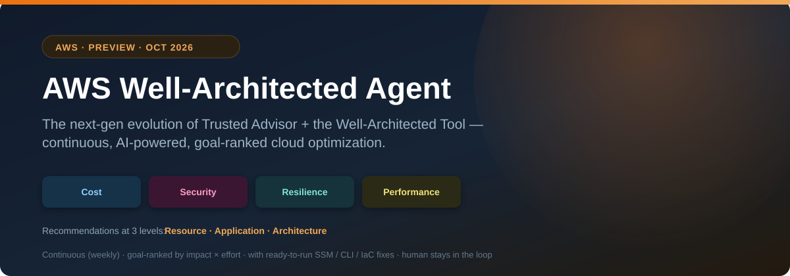
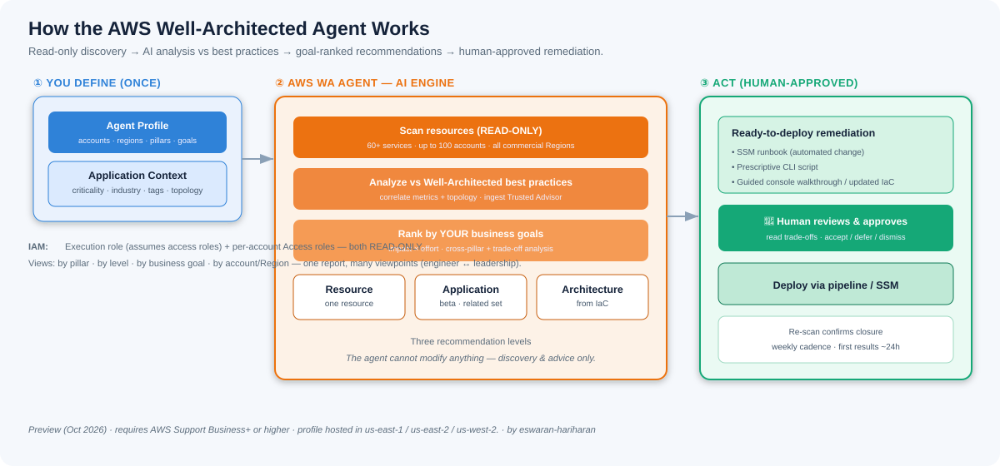
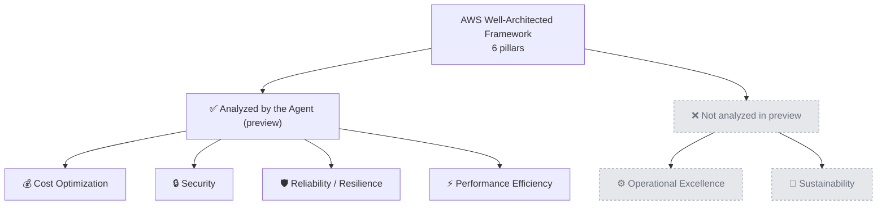
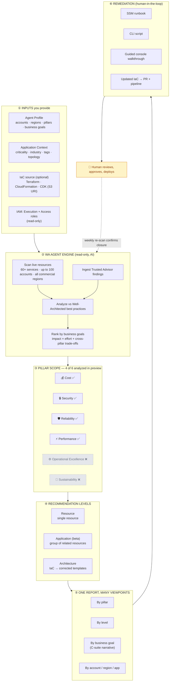
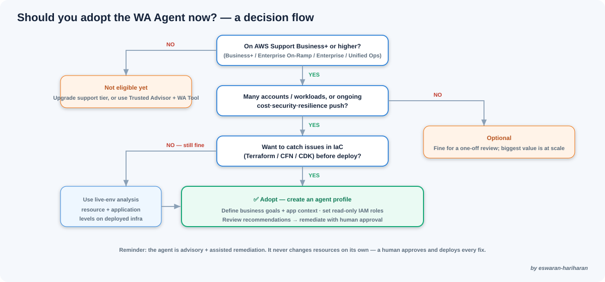
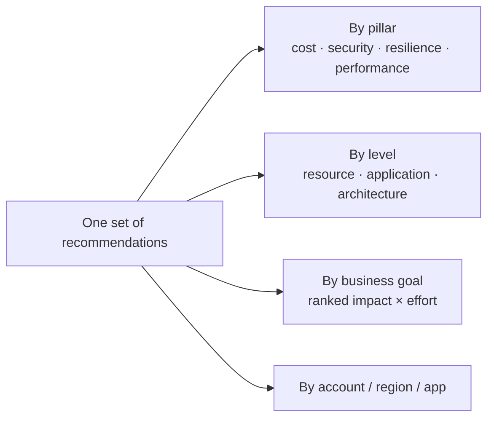

# The AWS Well-Architected Agent — An Architect's Field Guide

> **In a sentence:** AWS has turned its Well-Architected Framework from a periodic, manual questionnaire into an **always-on AI service** that continuously inspects your live environment *and* your infrastructure-as-code, then hands back prioritized, business-goal-ranked recommendations — many with ready-to-run fixes attached.

Announced in **preview (October 2026)**, the **AWS Well-Architected Agent (WA Agent)** is positioned by AWS as the **next-generation evolution of AWS Trusted Advisor and the Well-Architected Tool**. This guide is written for the people who have to decide whether to adopt it — **architects, principal engineers, and C-suite sponsors** — and it covers the whole picture: what it does, how to adopt it, how reports and viewpoints work, how remediation happens, and where humans still have to stay in the loop.

---

## Why this matters (the one-paragraph brief for leadership)

For a decade, a Well-Architected Review was a **point-in-time workshop**: senior engineers answered a long questionnaire, produced a findings document, and the organization slowly worked through it until the next review months later. The WA Agent collapses that cycle. It **runs continuously** (recommendations refresh on a **weekly cadence**), it reads your **actual deployed resources** rather than your description of them, and — critically for executives — it **ranks findings against the business goals you declare**, not against a generic checklist. The outcome: optimization becomes a steady operational signal instead of an occasional project.

---

## 1. How the agent helps

- **Removes the manual-review bottleneck.** No more scheduling a room full of architects for a day. The agent does the discovery and first-pass analysis continuously.
- **Turns findings into fixes.** It doesn't just tell you *what* is wrong — where applicable it ships the remediation: **SSM runbooks, prescriptive CLI scripts, guided console walkthroughs, and updated IaC**.
- **Prioritizes by *your* business goals.** You write plain-language goals (e.g. "reduce spend on non-production," "harden our payments platform"); recommendations are ranked by **impact and effort** against those goals.
- **Shows cross-pillar trade-offs *before* you act.** Every recommendation explains how acting on it affects the other pillars, with a risk level and mitigation — so you see the full consequence, not a single-axis "do this."
- **Reduces triage fatigue.** It ingests signals from existing services (e.g. **Trusted Advisor**) and adds personalization, prioritization, and automation-ready remediation on top — so teams stop drowning in undifferentiated findings.

---

## 2. What the agent covers

### The four optimization pillars
The agent analyzes your infrastructure across four pillars:

| Pillar | What it looks at |
|--------|------------------|
| **Cost optimization** | Waste, right-sizing, idle/underused resources |
| **Security** | Misconfigurations, exposure, weak controls |
| **Resilience / Reliability** | Single points of failure, missing multi-AZ/failover, recovery posture |
| **Performance** | Bottlenecks, inefficient resource choices |

*(Note: labels above are the guide's shorthand. The official pillar names are **Reliability** and **Performance Efficiency** — this guide uses "Resilience / Reliability" and "Performance" for readability.)*

### The six pillars vs. the four analyzed (what's in and out of scope)
AWS's Well-Architected Framework defines **six** pillars. The Agent preview analyzes **four** of them. Knowing the gap up front is part of an honest adoption decision:

| # | Well-Architected pillar | In the Agent preview? | Why / why not |
|---|-------------------------|:---------------------:|---------------|
| 1 | **Operational Excellence** | ❌ Not in preview | Leans on process, runbook culture, and team practices — hard to judge from read-only resource/config scans alone |
| 2 | **Security** | ✅ Analyzed | Misconfigurations, exposure, and weak controls are directly observable in resource config |
| 3 | **Reliability** | ✅ Analyzed | SPOFs, multi-AZ/failover gaps, recovery posture are inferable from topology + config |
| 4 | **Performance Efficiency** | ✅ Analyzed | Bottlenecks and inefficient resource choices show up in utilization metrics |
| 5 | **Cost Optimization** | ✅ Analyzed | Waste, idle, and right-sizing are measurable from usage data |
| 6 | **Sustainability** | ❌ Not in preview | Depends on carbon/energy and utilization-efficiency data that isn't first-class in the preview |

> **Bottom line on pillars:** nothing is "missing" by mistake — the preview deliberately targets the four pillars most assessable from read-only telemetry. If Operational Excellence or Sustainability are first-class requirements for you today, keep using the Well-Architected **Tool** questionnaire for those two until the Agent expands coverage.

### Three levels of recommendation (the "scope" dimension)
This is the key mental model. The agent reasons at three altitudes:

| Level | Scope | Example |
|-------|-------|---------|
| **Resource** | A single resource | An over-provisioned EC2 instance, an unencrypted RDS database, an idle Lambda |
| **Application** *(beta)* | A group of related resources that form an app | How components interact — guidance that accounts for the relationships, not just one box |
| **Architecture** | Your IaC templates | Gaps found by analyzing **Terraform, CloudFormation, or CDK** — returned as corrected templates |

> **Why three levels matter to a principal engineer:** a resource finding is a chore; an *architecture* finding is a design conversation. The agent deliberately separates "one misconfigured thing" from "a recurring pattern" from "the design itself departs from best practice."

### Breadth
The agent inspects configurations, utilization metrics, and application topology across **60+ AWS services**, and a single agent profile can analyze **up to 100 AWS accounts** and scan resources in **all commercial AWS Regions**.

---

## 3. How it works (the architecture)

**The flow in plain terms:**
1. You create an **agent profile** — the accounts, Regions, pillars, and **business goals** it optimizes for.
2. You optionally add **application context** (criticality, industry, tags, architecture overview) so recommendations are personalized rather than generic.
3. The agent **scans** your resources **read-only** (it cannot change anything — see §8).
4. It **analyzes** against Well-Architected best practices, correlating metrics and topology and ingesting other AWS findings.
5. It produces **prioritized recommendations** at the three levels, each with trade-off analysis and, where applicable, an **automation-ready fix**.
6. **A human reviews and deploys.**

---

## 4. How to adopt it

### Prerequisites (be honest with your sponsor about these)
- **An AWS Support plan at Business+ tier or higher** — Business+, Enterprise On-Ramp, Enterprise Support, or Unified Operations. **Developer and Business tiers do not get access.** This is a real cost/eligibility gate worth raising early.
- The agent profile is **hosted in US East (N. Virginia), US East (Ohio), or US West (Oregon)** — but it can **onboard/scan workloads from any commercial Region**.

### The IAM model (the part security teams will ask about)
Two role types, both **read-only by design**:

| Role | Where | Purpose |
|------|-------|---------|
| **Execution role** | Same account as the agent profile | The agent assumes it to **orchestrate discovery**; its only power is to assume your access roles |
| **Access role** | In **each** account you want scanned | Grants **read-only** access to resource metadata/config (via the `WellArchitectedAgentResourceScanning` managed policy) |

> **Say this to your CISO:** neither role can **modify** resources. The execution role can only assume access roles; access roles are read-only. The agent discovers and recommends — it never changes your environment on its own.

### Adoption steps
1. Confirm **Support tier eligibility**.
2. In the **Well-Architected console**, create an **agent profile** (accounts, Regions, pillars, business goals). Create or select the **execution role**.
3. Create **access roles** in each workload account and link trust policies.
4. Add **application context** for the workloads that matter most.
5. Let it scan — first recommendations arrive **within ~24 hours**; scheduled ones refresh **weekly**.
6. Review, then remediate (§7).

Programmatic access is available through the `wellarchitected` API namespace and CLI, so adoption can be scripted/GitOps-driven.

---

## 4.5 Inputs reference — exactly what you pass to the agent

This is the field-by-field view a principal engineer needs to actually configure the agent. The inputs fall into four groups.

### A. Agent profile (the primary configuration entity)

| Input | What you specify | Notes / limits |
|-------|------------------|----------------|
| **Accounts** | The AWS account IDs to analyze | Up to **100 accounts** per profile |
| **Regions** | Which Regions to scan | Scans **all commercial Regions**; the profile is *hosted* only in us-east-1, us-east-2, or us-west-2 |
| **Pillars** | Which of the four to analyze | Cost · Security · Reliability · Performance — all or a subset |
| **Business goals** | Plain-language optimization statements | Each goal **maps to one pillar** and drives ranking. e.g. *"reduce non-production spend by 30%"*, *"harden the payments platform"*, *"ensure tier-1 apps survive an AZ failure"* |
| **Execution role** | The read-only IAM role in the profile's account | Its only power is to assume the per-account access roles |

### B. Application context (personalization — the biggest lever on recommendation quality)

The "garbage in, generic out" input. The more you supply here, the less generic the output.

| Input | What you specify | Why it matters |
|-------|------------------|----------------|
| **Criticality** | Tier/importance (e.g. tier-1, mission-critical, dev/test) | Lets the agent weigh resilience/security harder on critical apps |
| **Industry** | Your sector (e.g. fintech, healthcare, retail) | Shapes compliance-flavored recommendations |
| **Tags** | Resource tags that define app boundaries | How the agent groups resources into an "application" for app-level findings |
| **Topology / architecture overview** | How components relate to each other | Enables application-level (beta) reasoning about interactions, not just single resources |

### C. IAM / access inputs (per scanned account)

| Input | What you specify | Notes |
|-------|------------------|-------|
| **Access role** | A read-only role in **each** scanned account | Uses the `WellArchitectedAgentResourceScanning` managed policy |
| **Trust policy** | Links each access role back to the execution role | So the execution role can assume it to orchestrate discovery |

### D. Architecture-review inputs (on-demand, the "shift-left" path)

| Input | What you specify | Notes |
|-------|------------------|-------|
| **IaC source** | An **S3 URI** of your templates, or an uploaded template | Terraform, CloudFormation, or CDK |
| **Pillars to apply** | Which pillars to evaluate the IaC against | Returns **deployment-ready corrected templates** |

### Not configuration fields, but required inputs to the decision
- **Support tier eligibility** — a hard gate, not a form field: **Business+, Enterprise On-Ramp, Enterprise, or Unified Operations**. Developer/Business tiers are blocked.
- **Cadence is fixed, not set by you** — first results in **~24 hours**, scheduled recommendations refresh **weekly**. There is no "schedule" field to configure.

---

## 5. When to use it (and when not to)

**Strong fit:**
- You run **many accounts/workloads** and manual reviews can't keep pace.
- You want **continuous** governance, not an annual audit.
- You're doing a **cost/security/resilience push** and need prioritized, goal-aligned targets.
- You want to catch issues in **IaC before deployment** (architecture reviews).

**Weaker fit / wait:**
- You're on **Developer/Business** support tiers (no access).
- You need the two Well-Architected pillars **not** covered in preview (Operational Excellence, Sustainability) as first-class analysis.
- You require a **fully autonomous** fix-it bot — this is advisory + assisted remediation, with a human in the loop by design (which is the right posture).

---

## 6. How to view the report — and the "view / viewpoint" model

Recommendations are surfaced in the **AWS Well-Architected console** (and via the `wellarchitected` **API/CLI** for teams that want to pull them into their own dashboards or ticketing).

The real power is that the **same findings can be read through different lenses** — which is what lets one tool serve both a principal engineer and a CFO:

- **Viewpoint = who's reading.** Leadership reads the **business-goal view** ("are we moving the needle on the goals we set?"); engineers read the **resource/architecture view** ("what exactly do I change?").
- **View = how it's sliced.** By **pillar**, by **level** (resource/application/architecture), by **business goal**, or by **account/Region/application**.
- Each recommendation carries: the **finding**, the **impact category**, a **cross-pillar impact** summary, a **trade-off analysis** (pillar affected, risk level, mitigation), and — where available — the **remediation artifact**.

Because goals are tied to pillars, the **same report rolls up to a leadership narrative** ("resilience goal: 3 of 5 critical gaps closed") *and* drills down to an engineer's task list — no separate reporting tool required.

---

## 7. How to remediate the observations

This is where the agent is more than an analyzer. Depending on the recommendation, it provides one or more **ready-to-deploy** remediation paths:

| Remediation artifact | What it is | Who runs it |
|----------------------|-----------|-------------|
| **SSM runbook** | An automation document that performs the change (e.g. enable multi-AZ failover) | Ops, via Systems Manager — after review |
| **Prescriptive CLI script** | Exact commands to apply the fix | Engineers |
| **Guided console walkthrough** | Step-by-step UI instructions | Anyone, for one-off changes |
| **Updated IaC** | Corrected **Terraform / CloudFormation / CDK** returned by an architecture review | Via your normal PR + pipeline |

**The recommended remediation loop:**
1. Open the recommendation; read the **trade-off analysis** and **cross-pillar impact**.
2. Decide: accept, defer, or dismiss (align with the business goal it maps to).
3. For accepted items, take the **provided artifact** — merge the IaC change through your pipeline, or run the SSM runbook/CLI in a controlled window.
4. Re-scan confirms closure on the next cycle.

> **Architecture reviews are the "shift-left" path:** point the agent at an **S3 URI of your IaC** (or upload a template), choose the pillars, and it returns **deployment-ready corrected templates** — so you fix the design *before* it reaches production, not after.

---

## 8. Where humans still have to intervene (don't skip this)

The agent is **advisory with assisted remediation — not autonomous**. Human judgment is required at several points:

- **It never changes your resources by itself.** Both IAM roles are **read-only**; every fix is applied by *you*.
- **You must review before deploying.** AWS explicitly flags that **application-level recommendations are beta** and, as with any AI-generated content, **each recommendation should be thoroughly reviewed before acting**.
- **You set the business goals.** The quality of prioritization depends entirely on the goals and application context you provide — garbage in, generic out.
- **Trade-off calls are yours.** The agent surfaces the trade-off (e.g. "multi-AZ improves resilience but raises cost"); the *decision* to accept that trade-off is a human/leadership one.
- **Change management still applies.** Runbooks and IaC changes should go through your normal approval, testing, and deployment windows.

> **The honest framing for your board:** this is a **force multiplier for your architects, not a replacement**. It removes the toil of discovery and first-pass analysis so your senior people spend their time on judgment, trade-offs, and the changes that matter.

---

## 9. Key terminology & concepts (so nothing's missed)

| Term | What it means |
|------|---------------|
| **Agent profile** | The primary entity — defines accounts, Regions, pillars, and business goals. (Different from a *WA Tool profile*, which is a questionnaire — don't confuse them.) |
| **Business goals** | Plain-text statements that steer prioritization; each maps to one pillar |
| **Optimization pillars** | Cost, Security, Resilience, Performance (the four analyzed in preview) |
| **Application context** | Extra info (criticality, industry, tags, topology, overview) that personalizes recommendations |
| **Recommendation levels** | Resource · Application (beta) · Architecture |
| **Architecture review** | On-demand IaC analysis → corrected Terraform/CFN/CDK templates (shift-left) |
| **Execution role / Access role** | The two read-only IAM roles that enable cross-account discovery |
| **Cross-pillar impact** | How acting on a recommendation affects the *other* pillars |
| **Trade-off analysis** | Pillar affected + risk level + mitigation strategy per recommendation |
| **Cadence** | First results ~24h; scheduled recommendations refresh **weekly** |

**Related services it builds on / complements:** AWS **Trusted Advisor** (findings it ingests), the **Well-Architected Tool** (the questionnaire it evolves beyond), and **Systems Manager** (how runbook remediations execute).

---

## The bottom line

- **For C-suite:** continuous, goal-aligned optimization across cost, security, resilience, and performance — delivered by AWS Support, gated behind Business+ support. It converts best-practice governance from an occasional project into an operational signal, with trade-offs made explicit before you spend.
- **For principal engineers & architects:** read your live environment *and* your IaC, get recommendations at resource/application/architecture levels with ready-to-run SSM/CLI/IaC fixes, and keep humans firmly in the approval loop.
- **The posture to adopt:** treat it as a **tireless first-pass reviewer**. Let it find and draft; keep your architects deciding and your pipelines deploying.

---

*Sources: AWS Well-Architected Agent preview announcement (Oct 2026) and the AWS Well-Architected User Guide. Content is paraphrased from official AWS documentation; this is a preview service, so verify current capabilities, Regions, pillars, and pricing/support eligibility against the official docs before adopting. Content was rephrased for compliance with licensing restrictions.*

**References:** [Preview announcement](https://aws.amazon.com/about-aws/whats-new/2026/10/aws-well-architected-agent/) · [What is WA Agent (User Guide)](https://docs.aws.amazon.com/wellarchitected/latest/userguide/agent.html) · [Concepts & terminology](https://docs.aws.amazon.com/wellarchitected/latest/userguide/agent-concepts.html)
